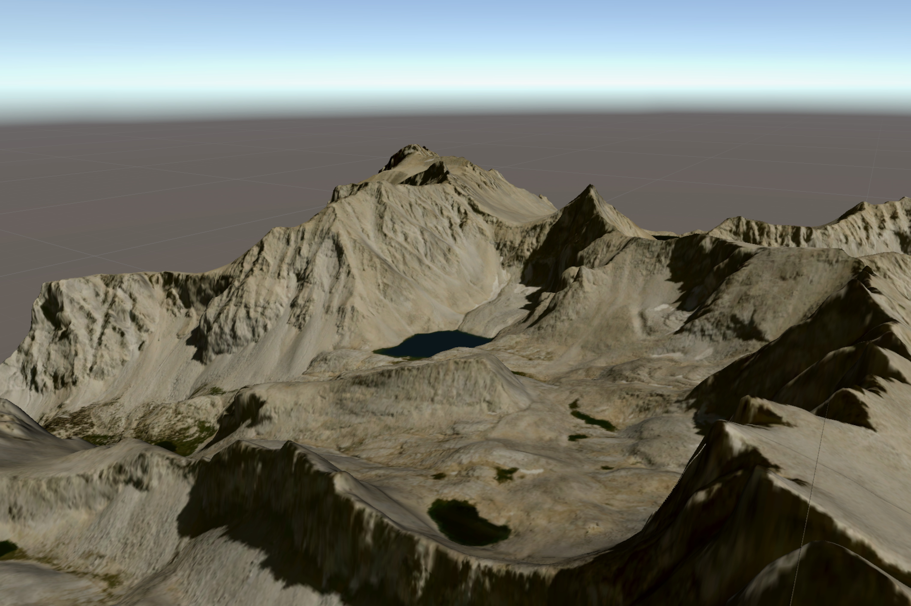

```{r setup, include=FALSE}
knitr::opts_chunk$set(echo = FALSE)
```

It's been a busy few months! Rather than try to make separate update posts for everything I've been up to, here's a list of the top bullets from my past four months.

## New Digs and New Gigs

I've left Boston and left Wayfair to take a PhD position at SUNY-ESF in Syracuse, working with Colin Beier and Aidan Ackerman to make 3D landscape visualizations as a way to improve the interpretability of ecological models and help democratize scientific outputs. 


## Paper: Stem size selectivity is stronger than species preferences for beaver, a central place forager

[My first first-authored paper is out in Forest Ecology and Management!](https://www.sciencedirect.com/science/article/abs/pii/S0378112720311002) I wrote a little about the process of this paper, from start to finish, [on my extremely short-lived newsletter.](https://systematica.substack.com/p/the-making-of)


## Tweetbots

I've now got a small army of robots living in the corner of my apartment, tweeting out to their heart's content. At the moment, I've got three retweet bots running off the original [ecology_tweets codebase](https://github.com/mikemahoney218/retweet_bot), namely [@ecology_tweets](https://twitter.com/ecology_tweets), [@rstats_tweets](https://twitter.com/rstats_tweets) (a more heavily-filtered alternative to the more popular rstatstweets bot), and [@30daymap_tweets](https://twitter.com/30daymap_tweets), built for the \#30DayMapChallenge.

More interesting are the two GPT-2 "AI" tweetbots now running, including [@fortunes_teller](https://twitter.com/fortunes_teller) and [@fund_me_please_](https://twitter.com/fund_me_please_). The former is trained against a collection of `fortunes` packages from various *nix distros and the R fortunes package, while the latter was run against 150 GRFP personal statements and is now tweeting out some frankly bizarre applications of its own making.


## {terrainr}

I've got a new R package out, the first real "product" from my PhD. {terrainr} wraps the USGS National Map family of APIs to help users download geospatial data for their areas of interest, and provides functionality to turn those files into tiles that can be imported into Unity for 3D landscape visualization:

```{r, echo=FALSE, fig.cap="A 3D landscape visualization of the area southeast of Mt. Whitney, California, USA."}

```

I love writing packages with visual outputs. I love writing packages with visual outputs that look like _this_. 


## Misc

I bought a [pen plotter.](https://www.instagram.com/p/CDJVN-JlB5R/)

<hr>

<script src="https://utteranc.es/client.js"
        repo="mikemahoney218/mm218.dev"
        issue-term="url"
        label="comment"
        theme="github-light"
        crossorigin="anonymous"
        async>
</script>
