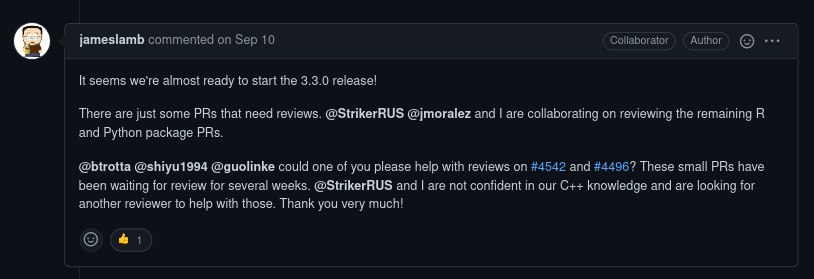

```{r setup, include=FALSE}
options(htmltools.dir.version = FALSE)
library(ggplot2)
knitr::opts_chunk$set(fig.showtext = TRUE, echo = TRUE, message = FALSE)
```

```{r xaringan-themer, include=FALSE, warning=FALSE}
library(xaringanthemer)
style_mono_light(base_color = "#23395b")
theme_set(theme_xaringan())
```

```{r xaringan-panelset, echo=FALSE}
xaringanExtra::use_panelset()
```

```{r xaringanExtra-search, echo=FALSE}
xaringanExtra::use_search(show_icon = TRUE)
```

```{r xaringan-tachyons, echo=FALSE}
xaringanExtra::use_tachyons()
```

```{r xaringan-extra-styles, echo = FALSE}
xaringanExtra::use_extra_styles(
  hover_code_line = TRUE,         #<<
  mute_unhighlighted_code = TRUE  #<<
)
```

```{r xaringan-tile-view, echo=FALSE}
xaringanExtra::use_tile_view()
```

class: middle

# The Saga of LightGBM

---

# August 25: I finish writing this lecture


---

# September 10: LightGBM team starts releasing 3.3.0



---

# October 9: LightGBM 3.3.0 gets to CRAN


---

# October 12: Issues are noticed


---

# October 25: LightGBM removed from CRAN


---

class: middle

# And as such, we had to make a few changes.

## • Different installation method
## • Different model fitting approach

---

## Different installation method:

<div style="font-size: 150%">
https://cran.microsoft.com/snapshot/2021-10-24/
</div>

<br />

<div style="font-size: 150%">
Daily CRAN snapshots, hosted by Microsoft.
</div>

---

## Different model fitting approach

<div style="font-size: 150%">
LightGBM 3.3.0: No more ... https://github.com/microsoft/LightGBM/issues/4226
</div>

<br />

<div style="font-size: 150%">
So everything but nrounds gets passed to param now.
</div>

---

```{r}
k_fold_cv <- function(data, k, ...) {
  per_fold <- floor(nrow(data) / k)
  fold_order <- sample(seq_len(nrow(data)), 
                       size = per_fold * k)
  fold_rows <- split(
    fold_order,
    rep(1:k, each = per_fold)
  )
  vapply(
    fold_rows,
    \(fold_idx) {
      fold_test <- data[fold_idx, ]
      fold_train <- data[-fold_idx, ]
      
      xtrain <- as.matrix(fold_train[setdiff(names(fold_train), 
                                             "Sale_Price")])
      ytrain <- fold_train[["Sale_Price"]]
      
      fold_lgb <- lightgbm(
        data = xtrain,
        label = ytrain,
        verbose = -1L,
        obj = "regression",
        ... # How it was
      )
      calc_rmse(fold_lgb, fold_test)
    },
    numeric(1)
  ) |> 
    mean()
}
```


---

```{r}
k_fold_cv <- function(data, k, nrounds = 10L, ...) {
  per_fold <- floor(nrow(data) / k)
  fold_order <- sample(seq_len(nrow(data)), 
                       size = per_fold * k)
  fold_rows <- split(
    fold_order,
    rep(1:k, each = per_fold)
  )
  vapply(
    fold_rows,
    \(fold_idx) {
      fold_test <- data[fold_idx, ]
      fold_train <- data[-fold_idx, ]
      
      xtrain <- as.matrix(fold_train[setdiff(names(fold_train), 
                                             "Sale_Price")])
      ytrain <- fold_train[["Sale_Price"]]
      
      fold_lgb <- lightgbm(
        data = xtrain,
        label = ytrain,
        verbose = -1L,
        obj = "regression",
        nrounds = nrounds, # Now its own parameter
        params = ... # How it now is
      )
      calc_rmse(fold_lgb, fold_test)
    },
    numeric(1)
  ) |> 
    mean()
}
```

---
class: middle

# Project FAQ

---

## Can I do X to my data?

<div style="font-size: 150%">
Yes.
</div>

## Do I need to do it for each of the models?

<div style="font-size: 150%">
It depends (but I won't make you).
</div>

## I get different results each time I run my grid

<div style="font-size: 150%">
Put a set.seed call right above the grid. Run it every time.
</div>

---

## My GBM learning rate seems too low.

<div style="font-size: 150%">
No such thing. Lower is usually more accurate (or at least equivalent), just 
takes more time (and rounds). Your goal is to find "good enough".
</div>

## My top hyperparameter combinations are really variable.

<div style="font-size: 150%">
Those hyperparameters don't matter that much. Especially common with random 
forests.
</div>

---
class: center 

```{r, echo=FALSE, out.width='80%'}
knitr::include_graphics("https://objects-us-east-1.dream.io/secrettoeverybody/images/secret.png")
```

Change the .html to .Rmd to download the code & text used in the slides.

---
class: middle

# Reproducibility Methods

---

## Sometimes package updates break things

## Sometimes CRAN delists packages

## Sometimes both of these things happen!

## What do?

---

## Option 1: Use as little package code as possible

<div style="font-size: 150%">
R is pathologically opposed to change.
</div>

<br />

<div style="font-size: 150%">
Major releases through the years:
</div>

<div style="font-size: 150%">
1.0: Feb 29, 2000
</div>

<div style="font-size: 150%">
2.0: Oct 04, 2004
</div>

<div style="font-size: 150%">
3.0: Apr 03, 2013
</div>

<div style="font-size: 150%">
4.0: Feb 29, 2020
</div>

---


<div style="font-size: 150%">
(Nathan Eastman: poorman talk, useR! 2021)
</div>

---

## Option 2: Freeze your dependencies

<div style="font-size: 150%">
Two main approaches. First one: choose a point in time and stick to it.
</div>

<br />

<div style="font-size: 150%">
MRAN daily snapshots: [https://cran.microsoft.com/snapshot/2021-10-24/](https://cran.microsoft.com/snapshot/2021-10-24/)
</div>

<br />

<div style="font-size: 150%">
Not super flexible -- if you need to update a dependency, you need to update them all.
</div>

---

<div style="font-size: 150%">
Better option: freeze the version of each dependency separately.
</div>

<br />

<div style="font-size: 150%">
Best tool for this: renv [https://rstudio.github.io/renv/articles/renv.html](https://rstudio.github.io/renv/articles/renv.html)
</div>

<br />

<div style="font-size: 150%">
"Snapshot" a working version of your project, update packages, restore to last working state if needed. 
</div>

---

## Option 3: Freeze your computer

<div style="font-size: 150%">
Docker lets you run things in "containers" -- separate all your code and dependencies from your computer. Can save entire system configuration as an "image".
</div>

<br />

<div style="font-size: 150%">
Using Docker with R usually takes advantage of 
[https://github.com/rocker-org/rocker](https://github.com/rocker-org/rocker)
</div>

<br />

<div style="font-size: 150%">
Likely best option for long term reproducibility. Most technical.
</div>
