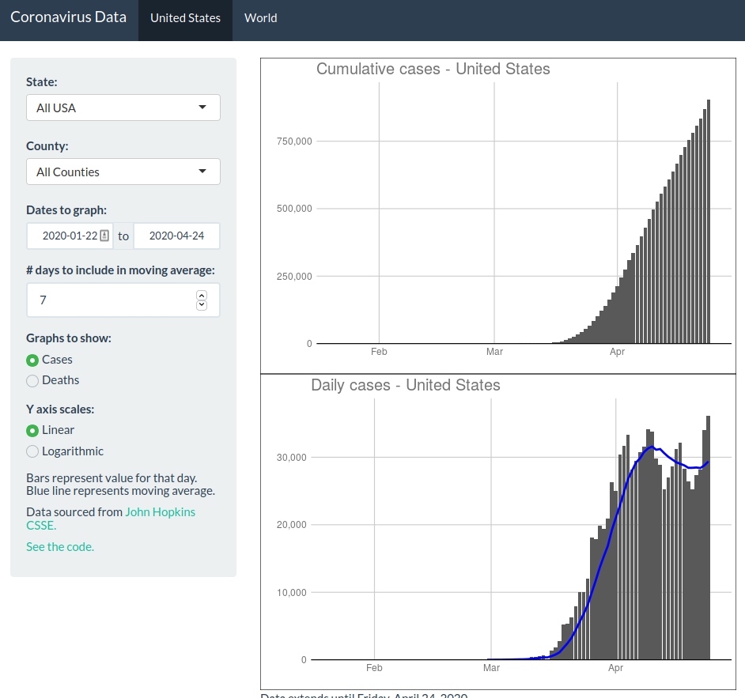

I had been getting frustrated with not being able to quickly find coronavirus
data for my area, and not being able to see recent trends without framing and
interpretation. So I grabbed down the John Hopkins CSSE data and made a quick
Shiny app to visualize case and death rates. 
I'm trying to not contribute to 
the constant noise surrounding the ongoing pandemic, but having a 
way to see these numbers without an overwhelming amount of surrounding 
editorialization has made me feel like I understand the world a bit better.

```{r, out.width='100%'}

```


[The app lives at this link](https://mm218.shinyapps.io/corona_data_explore/).
Thanks to R Studio, who are providing free hosting for coronavirus apps through
the pandemic.
