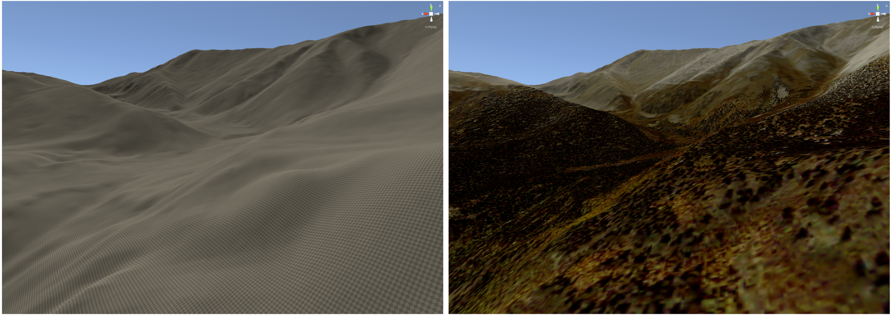

```{r setup, include=FALSE}
knitr::opts_chunk$set(echo = FALSE)
```

I've got a [new paper out at the Journal of Open Source Science](https://joss.theoj.org/papers/10.21105/joss.04060),
documenting the ["terrainr" package](https://www.mm218.dev/posts/2020/10/) I've been developing since late 2020.
JOSS is a fantastic journal and is entirely open-source, so that first link should work for everyone.

```{r, fig.cap='Left: Where typical geodata-to-IVE workflows leave you. Right: Where terrainr gets you.'}

```

The JOSS workflow is absolutely fascinating. I made a 
[git branch in the terrainr repo](https://github.com/ropensci/terrainr/tree/paper) 
with the files needed to generate the paper, then (through a web form) opened a
[pre-review issue on GitHub](https://github.com/openjournals/joss-reviews/issues/4055).
The editors used that issue to assign a handling editor, then moved things over to
[a review issue](https://github.com/openjournals/joss-reviews/issues/4060), where
the paper was processed and prepared for submission via an 
[automatically generated PR](https://github.com/openjournals/joss-papers/pull/2885).
The whole thing was incredibly efficient, and also entirely transparent -- the logs of
the paper processing workflow will be available until GitHub finally shuts down, a 
refreshing change compared to standard peer review.

The paper itself is a general overview of the terrainr package, trying to 
be a new enough contribution that it's not just repeating the package documentation 
but not adding enough to spin off into
[an entirely separate research project](https://www.mm218.dev/posts/2021-06-14-interactive-landscape-simulations-for-visual-resource-assessment/).
It's also very short -- a nice feature of JOSS papers -- so rather than summarize here I'll just
suggest you [read it yourself](https://www.mm218.dev/papers/terrainr_2022.pdf).

<hr>

<script src="https://utteranc.es/client.js"
        repo="mikemahoney218/mm218.dev"
        issue-term="url"
        label="comment"
        theme="github-light"
        crossorigin="anonymous"
        async>
</script>
