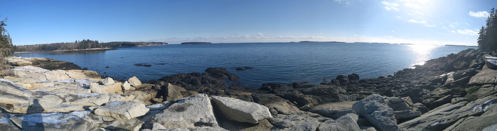

```{r echo=FALSE}

```


Today is my birthday, so please forgive me one of the most self-indulgent things I will ever write.

Two years ago I was living in Boston, working in tech, and a good bit bored. I was recognizing that I had spent most of the past year focusing on goals I had because they were the obvious next step, not because they were building me a life I wanted to live. I had lost a sense of agency over the future.

Luckily, at the time, I had just come across this podcast called "Cortex". Over the holiday season, the hosts had discussed how they structure their goals around a "yearly theme" -- not New Years' Resolutions, not specific targets that you either achieve or fail at, but a broad concept that they use to inform their decisions over the course of the year. The point is to gently nudge your life in the direction you want it to go. [Here's a video with more information about this](https://www.youtube.com/watch?v=NVGuFdX5guE); I recommend it.

So I decided that 23 would be my year of Progress; that I'd try and make a habit of making decisions that helped build momentum and kept me moving forward. I quit my job, started a PhD, moved states, and started building the personal and professional networks I rely on today. It wasn't all perfect -- about a month in there was a global pandemic I really wish I could have done something to prevent -- but it nudged my life's trajectory in a direction I've been happy with.

So when 24 came and it was time to change my theme, I decided to make it the year of Purpose. The year of Progress had involved saying yes to every opportunity that came my way; with Purpose, I wanted to make sure that I was being intentional with how I spent my time and making explicit decisions about where I'd invest my energy. I'm still not great at it, but I've gotten better at saying no when needed. I spent time improving my organization and time management to help me efficiently work through the things I said yes to. And I made a point of learning to consciously decide when to take time off, when to disconnect, and when to purposefully relax, so that I can now make those decisions without worrying about all the things I "should" be doing instead.

Now it's 25, and it's time for a new theme. I think my plan is for the year of Process: I like where I am with my life right now, and I like how I spend my time. But I could be better and more careful about how I approach both of those things. I'm going to try to get better with details, to improve my memory around small things. 

I told you this would be indulgent. I know this sounds froofy. But it's worked for me for two years now and I'm betting on round three. And I'm looking forward to seeing where this year takes me.
