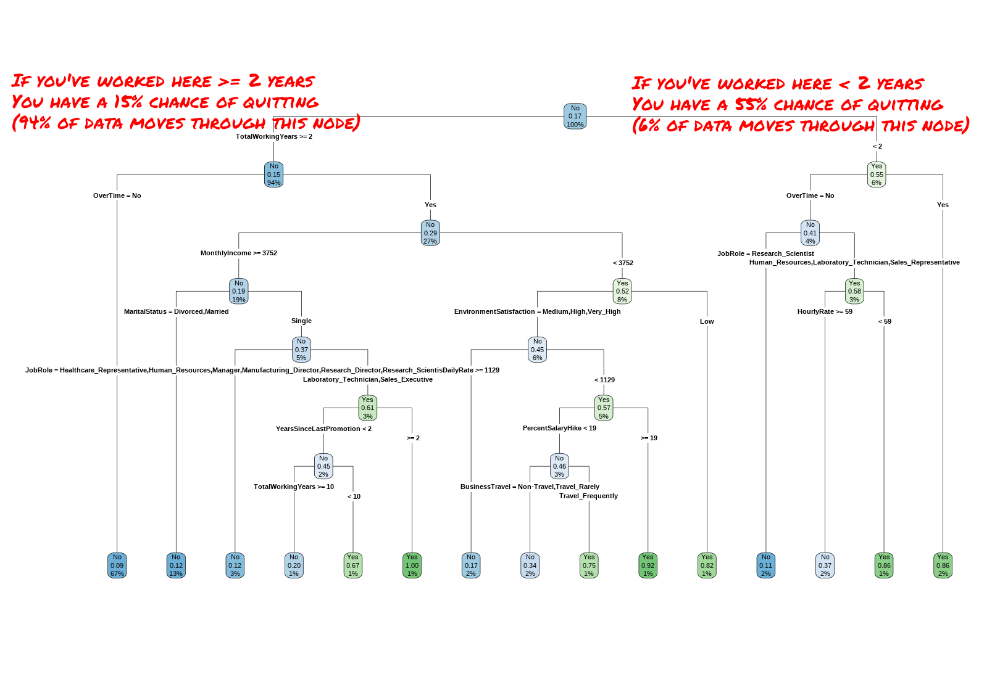
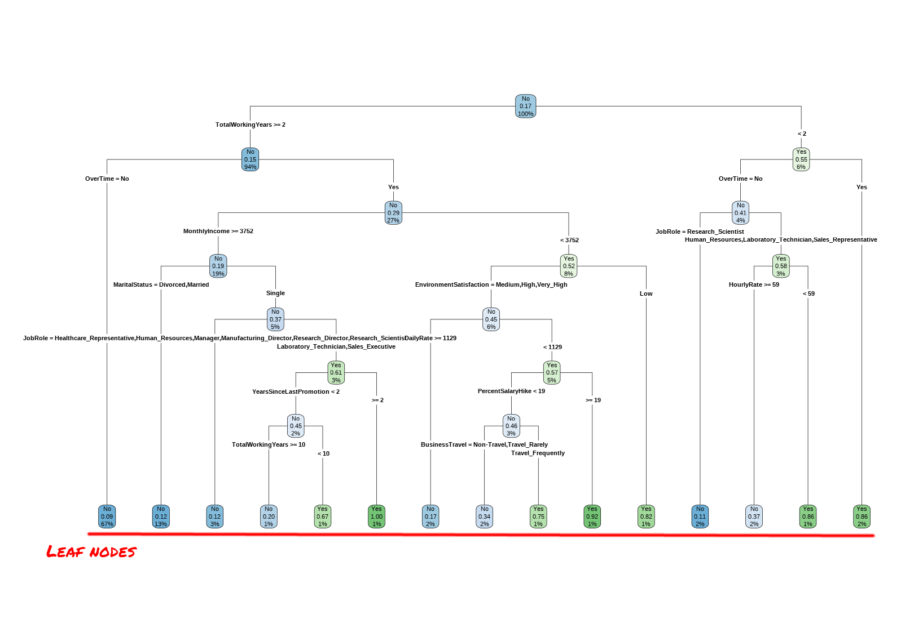
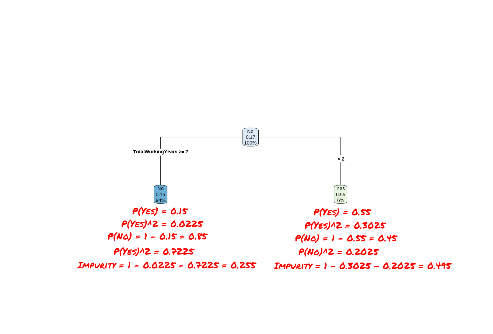

```{r setup, include=FALSE}
options(htmltools.dir.version = FALSE)
library(ggplot2)
library(dplyr)
knitr::opts_chunk$set(fig.showtext = TRUE)
```
```{r xaringan-themer, include=FALSE, warning=FALSE}
library(xaringanthemer)
style_mono_light(base_color = "#23395b")
theme_set(theme_xaringan())
```

```{r xaringan-editable, echo=FALSE}
xaringanExtra::use_editable(expires = 1)
```

```{r xaringan-panelset, echo=FALSE}
xaringanExtra::use_panelset()
```

```{r xaringanExtra-search, echo=FALSE}
xaringanExtra::use_search(show_icon = TRUE)
```

```{r xaringan-tachyons, echo=FALSE}
xaringanExtra::use_tachyons()
```

```{r xaringan-extra-styles, echo = FALSE}
xaringanExtra::use_extra_styles(
  hover_code_line = TRUE,         #<<
  mute_unhighlighted_code = TRUE  #<<
)
```

```{r xaringan-tile-view, echo=FALSE}
xaringanExtra::use_tile_view()
```

class: center, middle

# Decision Trees

---

.bg-washed-green.b--dark-green.ba.bw2.br3.shadow-5.ph4.mt5[

Binary trees give an interesting and often illuminating way of looking at data in classification or regression problems. They should not be used to the exclusion of other methods. We do not claim that they are always better. They do add a flexible nonparametric tool to the data analyst’s arsenal.

.tr[
— [Leo Breiman, Jerome Friedman, Charles J. Stone, R.A. Olshen: Classification and Regression Trees.](https://www.routledge.com/Classification-and-Regression-Trees/Breiman-Friedman-Stone-Olshen/p/book/9780412048418)
]
]

---
class: middle

So far, we've focused almost entirely on traditional parametric regression 
models. Up until now we've stuck with models that require normally distributed 
residuals, linear associations between your predictors and outcome, and 
idnependent, non-correlated predictors.

The problem with these methods is that those assumptions are almost always 
broken. As Tobler's law puts it, everything is related to everything else, 
violating our assumption of independent predictors. 

Especially in the natural 
sciences, those relations tend to be deeply nonlinear, violating our assumption
of linearity as effects saturate or grow exponentially.

---
class: middle

Today we're going to talk about our first truly machine learning algorithm, the 
decision tree, which was specifically designed to help social scientists deal 
with a nonlinear world. 

It's worth taking a second to note the timeline we're walking through. Linear 
regression was first proposed in 1805; the first logistic regression was 
performed in 1838.

Decision trees were introduced for the first time in 1960; the method we'll be
using today was published in 1974, and it's the oldest machine learning method
we'll cover in this course. As a result, we're starting to leave the realm of 
"this is proven to be true" and entering of "this is the current consensus" --
you might find older papers applying these techniques in wildly different ways
than we discuss, or find newer papers advocating for methods we didn't discuss.
I'll attempt to stick to generally accepted facts, but it's worth flagging.

---
class: middle

The last thing I want to point out before we start actually building trees is 
that decision trees are pretty rarely the best choice for any problem. If you're
looking for a highly explainable non-linear model, you might choose general 
additive models instead; to maximize predictive accuracy you'll probably want to 
use random forests or gradient boosting machines.

But random forests and gradient boosting machines are built on top of decision 
trees, so it's important that we discuss them here. However, there's no 
assignment for this week; since the assignments are designed to give you code
templates you might actually use in your own work, and you'll almost never use
decision trees in your own work, it doesn't make sense for us to spend time 
learning how to code them.

---

With all that said, let's get started!

We'll be using the `rpart` package today, alongside the `rpart.plot` package for
visualization:

```{r eval=FALSE}
install.packages("rpart")
install.packages("rpart.plot")
```

```{r}
library(rpart)
library(rpart.plot)
```

We'll also keep using the same old attrition data:

```{r}
library(modeldata)
data(attrition)
```

And will use `caret` and `pROC` for assessing our models:

```{r}
library(caret)
library(pROC)
```

---
class: middle

We're also going to recreate our training and testing splits using the same code 
as before:

```{r}
set.seed(123)
row_idx <- sample(seq_len(nrow(attrition)), nrow(attrition))
training <- attrition[row_idx < nrow(attrition) * 0.8, ]
testing <- attrition[row_idx >= nrow(attrition) * 0.8, ]
```

To create a decision tree, we can use the `rpart` function from the `rpart` 
package. The syntax is almost exactly like `lm` -- we just need to provide a 
formula and our data:

```{r}
decision_tree <- rpart(Attrition ~ ., data = training)
```

We can then create a confusion matrix for our classifications just as we did 
with logistic regressions. I've printed this out on the next slide.

---

```{r}
confusionMatrix(predict(decision_tree, training, type = "class"), 
                training$Attrition, 
                positive = "Yes")
```

---

So, we have a decision tree and we've used it to make predictions.

But... what _is_ it? We can get some ideas of what we're working with by 
visualizing it. We'll use the `rpart.plot` function to display our actual model:

```{r, eval = FALSE}
rpart(Attrition ~ ., data = training) |> 
  rpart.plot(type = 4)
```

```{r echo = FALSE}
knitr::include_graphics("week_4_imgs/rpartplot.png")
```

---

You can think of a decision tree as being effectively a flow chart, which your
data follows until the model has decided how to classify it.

```{r echo = FALSE}
knitr::include_graphics("week_4_imgs/rpartplot.png")
```

---

Each of these boxes is called a **node**. We start reading this chart at the very
top of the diagram, at what's called the **root node**. 

```{r echo = FALSE}
knitr::include_graphics("week_4_imgs/rpartplot_root.png")
```

---

Because only 17% of our employees in the training data quit (labeled "No"), we 
can see that `rpart` assigns this node "No". Below the label, we can see the 
probability of a data point in this node being a "No" (17%) and the percentage 
of our data that has to go through this node to be classified (100%).

```{r echo = FALSE}
knitr::include_graphics("week_4_imgs/rpartplot_root.png")
```

---

If we want to be more accurate than that, we need to start moving down this flow
chart. We'll start off with our first split (sometimes called **branches**), 
which asks each of our observations if their TotalWorkingYears is >= 2.

```{r echo = FALSE}
knitr::include_graphics("week_4_imgs/rpartplot_root.png")
```

---

If an employee has been working for more than 2 years, they go down the left 
path (15% probability of quitting, 94% of employees). If an employee has less 
than 2 years, they go down the right (55% probability, 6% of employees).

```{r echo = FALSE}

```

---

And so the employees go, down the tree until they land into the buckets -- 
called **leaf nodes** -- at the bottom of the chart. These are our final 
classifications; employees in the blue bins will be classed as "No" and 
employees in the green bins as "Yes".

```{r echo = FALSE}

```

---

And that's a decision tree -- a flow chart with a bunch of yes/no questions that
you follow until you get a final classification. 

```{r echo = FALSE}

```

---

There's a few really interesting features of this algorithm. First off, our 
observations can take different _length_ paths down the decision tree. 

Almost 70% of employees will go through this decision tree in two splits, either 
on the far left or right. 1% will take seven steps.

```{r echo = FALSE}
knitr::include_graphics("week_4_imgs/rpartplot_diffsplits.png")
```

---

Similarly, not all variables are used to classify every observation. A lot of 
our variables used in this tree are only used to sort 5% or less of the data. 
The entire tree only uses 10 variables, even though in our formula we said to 
use all 30 predictors in our data frame.

```{r echo = FALSE}
knitr::include_graphics("week_4_imgs/rpartplot_rarevars.png")
```

---

And yet, at the same time, our tree uses the variable "TotalWorkingYears" to
create two separate splits.

```{r echo = FALSE}
knitr::include_graphics("week_4_imgs/rpartplot_doubled.png")
```

---
class: middle

Decision trees are really interesting because they'll only use variables that 
actually help them make better predictions. If using more variables in split 
rules won't improve accuracy, then the tree won't use more variables. 

At the same time, decision trees will always use the variable which helps them
improve predictive accuracy the most. If a variable is the best choice for 
multiple positions in the tree, it can be used multiple times.

Which leads us to two questions: how do decision trees know which variables to 
use? And how do they know when to stop splitting?

---

To answer the first question, let's think about a tree with only one split.

```{r eval = FALSE}
rpart(Attrition ~ TotalWorkingYears, data = training) |> 
  rpart.plot(type = 4)
```


```{r echo = FALSE}
knitr::include_graphics("week_4_imgs/twy.png")
```

---

Because each of our leaf nodes has more than one class in it (they both have 
"Yes" and "No" values), we refer to them as being **impure**. 

Our decision tree will select the variable at each split that creates the most
pure nodes -- or, put another way, the variable which reduces impurity the most.

```{r echo = FALSE}
knitr::include_graphics("week_4_imgs/twy.png")
```

---

In order to do that, we need to quantify impurity somehow. The most popular 
method is to calculate the **Gini impurity** values of each node. 

For a given node, the Gini impurity $G$ is equal to:

$$G = 1 - \left(\operatorname{Probability of yes}\right)^{2} - \left(\operatorname{Probability of no}\right)^{2}$$

---

We can use that equation to pretty quickly calculate the impurity of each of
our nodes.

```{r echo = FALSE}

```

---

To calculate the variable which reduces impurity the most for _both_ nodes at
the same time, however, we need to take the weighted average of these node
impurities by multiplying each node's impurity by the proportion of observations
in the node.

```{r echo = FALSE}

```

---

Because our root node has 100% of the observations, we can just multiply each 
impurity by the percentage of all observations in that bin and then add them 
together, for a total impurity of 0.2694.

```{r echo = FALSE}
knitr::include_graphics("week_4_imgs/twy_impurity_overall.png")
```

---

When deciding what variable to use for a split, a decision tree will calculate 
the overall impurity for each possible variable and choose the split with the
lowest value.

When working with continuous variables (like we did above), the decision tree 
will evaluate the value halfway between every level in the variable -- so if 
the column in your data frame has the values 1, 3, and 5, the decision tree will
evaluate splitting using that variable at both 2 and 4.

When working with categorical variables, the decision tree will evaluate each
combination of categories it can and choose the most successful grouping.

And the tree will keep doing this until it has correctly classified all of the
training data, or until it hits some user-specified maximum number of splits or
minimum number of observations in the leaf nodes.

---

Now, why would a user specify a maximum number of splits or minimum number of
observations? Shouldn't we want our tree to classify every observation correctly?

Unfortunately, no. Decision trees are notorious overfitters, and left to their 
own devices will create trees that are so attached to the nuances of your 
training data that they fail to predict any observation they haven't seen before. 

To demonstrate this, let's look at two confusion matrices. The next slide will
have the confusion matrix for this decision tree when predicting the training 
set, and then the slide after that will have the test set confusion matrix.

---

```{r}
confusionMatrix(predict(decision_tree, training, type = "class"), 
                training$Attrition, 
                positive = "Yes")
```

---

```{r}
confusionMatrix(predict(decision_tree, testing, type = "class"), 
                testing$Attrition, 
                positive = "Yes")
```

---

Our model which against the training set had 83% positive predictive value and
40% sensitivity all of a sudden has only 57% positive predictive value and 33%
sensitivity! 

When a model performs dramatically better against the training data than the 
test set, that's a sign of **overfitting** -- it means our model fails to 
generalize when predicting data it's never seen before, because it's effectively
"learned" how to categorize each observation in the training data.

Unlike traditional regression, where the solution for overfitting is to remove
weakly correlated variables, with machine learning our solution for overfitting
is generally to change how the model actually works. 

---

For instance, if we want our model to make at most two splits, we can use the
`control` argument in `rpart` to specify that `maxdepth` should equal `2`:

```{r eval = FALSE}
rpart(Attrition ~ ., data = training, control = list(maxdepth = 2)) |> 
  rpart.plot(type = 4)
```

```{r echo = FALSE}
knitr::include_graphics("week_4_imgs/maxdepth.png")
```

---

If we wanted instead to make sure that every leaf had at least 100 observations,
we could set the `minbucket` argument:

```{r eval = FALSE}
rpart(Attrition ~ ., data = training, control = list(minbucket = 100)) |> 
  rpart.plot(type = 4)
```

```{r echo = FALSE}
knitr::include_graphics("week_4_imgs/minbucket.png")
```

---

We call values like `maxdepth` and `minbucket` which control the behavior of our 
algorithm **hyperparameters**. 

Just like the coefficients in a linear regression, the precise values of each 
hyperparameter can be very important in influencing our predictions; unlike 
coefficients, however, hyperparameters can't be automatically determined when 
fitting your model to the training data.

Instead, the optimal hyperparameter values have to be determined separately from
fitting the model. While there might be some common default values that people
start with, generally speaking finding the right hyperparameter values requires
a process of trial and error, eventually choosing the values that give you the
best results against your validation set.

That's all that we'll talk about hyperparameters today; we'll spend more time 
talking about how to find the best values in two weeks.

---

In addition to being nasty overfitters, decision trees have one more major 
drawback. For instance, here's the histogram of probabilities predicted by a
full logistic model:

```{r, echo=FALSE, message=FALSE, warning=FALSE, fig.width=10, fig.height=2.5}
logistic_model <- glm(Attrition ~ ., data = training, family = "binomial")
qplot(predict(logistic_model, testing, type = "response"))
```

And now, here's the histogram of probabilities predicted by our decision tree:

```{r, echo=FALSE, message=FALSE, warning=FALSE, fig.width=10, fig.height=2.5}
qplot(predict(decision_tree, testing)[,2])
```

The logistic graph looks like what we might expect -- a smooth curve, 
asymptotically approaching 0 as you get towards 100% quitting. The decision tree
graph does not.

---

That's because, for a decision tree, your probability of being "Yes" is equal to
the percentage of your bin that is "Yes". This means that our tree, which has
15 leaf nodes, is only capable of predicting at most 15 different values. 

```{r echo = FALSE}
knitr::include_graphics("week_4_imgs/rpartplot.png")
```

---

This can lead to some very weird prediction surfaces -- while traditional 
methods like logistic regression create smooth transitions in probability, 
decision trees are known for creating odd surfaces with hard right angles at
their splits.

For instance, 

```{r echo=FALSE, fig.height=3, warning=FALSE}
decision_tree <- rpart(Attrition ~ TotalWorkingYears + MonthlyIncome, 
                       data = training)

decision_grid <- expand.grid(
  TotalWorkingYears = seq(
    min(attrition$TotalWorkingYears), 
    max(attrition$TotalWorkingYears), 
    length.out = 100),
  MonthlyIncome = seq(
    min(attrition$MonthlyIncome), 
    max(attrition$MonthlyIncome), 
    length.out = 100)
)

decision_grid$prediction <- predict(decision_tree, decision_grid)[, 2]


logmod <- glm(Attrition ~ TotalWorkingYears + MonthlyIncome, 
                       data = training,
              family = "binomial")

decision_grid$prediction <- predict(logmod, decision_grid, type = "response")

ggplot(decision_grid, aes(TotalWorkingYears, MonthlyIncome, fill = prediction)) + 
  geom_raster() + 
  ggtitle("Logistic regression")
```

```{r echo=FALSE, fig.height=3, warning=FALSE}
decision_grid$prediction <- predict(decision_tree, decision_grid)[, 2]
ggplot(decision_grid, aes(TotalWorkingYears, MonthlyIncome, fill = prediction)) + 
  geom_raster() + 
  ggtitle("Decision tree")
```

---

And while we've focused today entirely on classification, I want to point out 
that all the same techniques can be applied to regression as well. For instance,
if we load our Ames housing data:

```{r}
library(AmesHousing)
ames <- make_ames()
row_idx <- sample(seq_len(nrow(ames)), nrow(ames))
training <- ames[row_idx < nrow(ames) * 0.8, ]
testing <- ames[row_idx >= nrow(ames) * 0.8, ]
```

We can use the exact same syntax to fit a regression model:

```{r}
ames_tree <- rpart(Sale_Price ~ ., data = training)
```

Which we can then calculate the holdout set RMSE of via:

```{r}
sqrt(mean((predict(ames_tree, testing) - testing$Sale_Price)^2))
```

That's an improvement from the last linear model we fit to the same data!

---

And just like with classification, our model will only be able to predict a set
number of values. For instance, here's what the prediction surface of a decision
tree trained using only two variables, `Year_Built` and `Gr_Liv_Area`, looks
like:

```{r}
small_model <- rpart(Sale_Price ~ Gr_Liv_Area + Year_Built, data = training)

decision_grid <- expand.grid(
  Gr_Liv_Area = seq(
    min(training$Gr_Liv_Area), 
    max(training$Gr_Liv_Area), 
    length.out = 100),
  Year_Built = seq(
    min(training$Year_Built), 
    max(training$Year_Built), 
    length.out = 100)
)

decision_grid$Sale_Price <- predict(small_model, decision_grid)

ggplot(decision_grid, aes(Gr_Liv_Area, Year_Built, fill = Sale_Price)) + 
  geom_raster() + 
  ggtitle("Decision tree regression")
```

---

These weird prediction surfaces can still generate really good predictions. But
it does make model interpretation a bit harder -- in the last graph, for 
instance, we could say that homes built after 1980 sell for more money, as well 
as homes built after 1950 if they're under 1,500 square feet, and also after
2000 if they're between 1,600 and 2,000 square feet, and --

Decision trees are our first machine learning algorithm in this course, and they
bridge the gap from estimation methods (such as linear regression) to pure 
predictive algorithms like we'll focus on for the rest of the semester. These 
methods trade model interpretability for flexibility -- we don't need to worry
about any of the linear model assumptions with these tools -- and predictive 
accuracy. 

Next week, we'll make the jump all the way into pure prediction with random 
forests. 

---

.bg-washed-green.b--dark-green.ba.bw2.br3.shadow-5.ph4.mt5[

Binary trees give an interesting and often illuminating way of looking at data in classification or regression problems. They should not be used to the exclusion of other methods. We do not claim that they are always better. They do add a flexible nonparametric tool to the data analyst’s arsenal.

.tr[
— [Leo Breiman, Jerome Friedman, Charles J. Stone, R.A. Olshen: Classification and Regression Trees.](https://www.routledge.com/Classification-and-Regression-Trees/Breiman-Friedman-Stone-Olshen/p/book/9780412048418)
]
]

---
class: middle center title-slide

## No assignment this week
