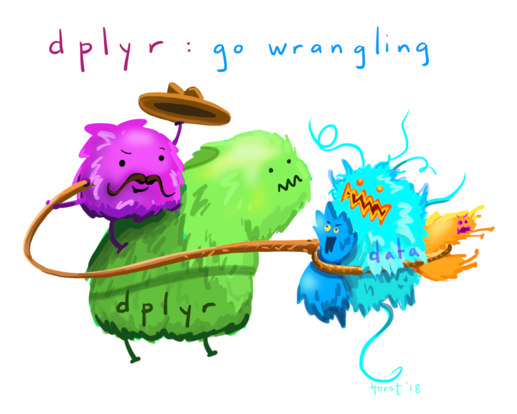

class: center, middle

```{r setup, include=FALSE}
knitr::opts_chunk$set(fig.width = 8, fig.height = 4, message = FALSE, warning = FALSE, comment = "", cache = FALSE, fig.retina = 3)
library(flipbookr)
```



---

`dplyr` was also installed when you installed `tidyverse`, so let's just load it
now:

```{r}
library(dplyr)
```

<br>

`dplyr` gives us the `select()` function, which works a little differently.  
We call it like `sqrt()` or `plot()` functions, and pass it our data frame as 
the first argument, then the names of the columns we want to access:

```{r}
head(
  select(iris, Sepal.Length, Sepal.Width) # Note: no quotes!
)
```

---

You'll notice that `select()` returns a data frame, just like `[]`. Actually, 
all `dplyr` functions return data frames (and usually take them as inputs) -- 
that's what the `d` in `dplyr` stands for!

<br>

But `dplyr` provides a lot more than just `select()`. For instance, let's say we
wanted to find all the irises with sepals that are more than 5 cm long.

<br>

We already know how to get R to tell us if each sepal length is longer than 5 cm,
using logical operators:

<br>

```{r, message=FALSE}
head(
  iris$Sepal.Length > 5
)
```

---

We can combine that with the `filter()` function from `dplyr` to return the full
row every time that condition is `TRUE`. 

<br>

For example, this code returns each row where Sepal.Length is greater than 5:

```{r}
head(
  # we don't need to subset iris when using dplyr functions!
  filter(iris, Sepal.Length > 5)
)
```

---

Now, what if we wanted to do both of those -- if we wanted to filter our dataset
_and_ select specific columns?

One way we can do things like this is by _nesting functions_ -- that is, 
putting a function entirely inside of another function. 

For instance, we can replace the data argument in `select()` with the entire 
`filter()` call:

```{r}
head(
  select(
    # We replaced the iris dataset with the filtered one --
    # since it returns a data frame, we can use it as the data 
    # argument to select
    filter(iris, Sepal.Length > 5),
    # The other arguments to select are the same:
    Sepal.Length, 
    Sepal.Width)
)
```

---

We've done this a few times before:

```r
# aes is a function inside the ggplot function!
ggplot(<data>, aes(<mapping>))
```

<br>

```r
# c is a function inside the data.frame function!
data.frame(x = c("one", "two"),
           y = c(9, 8))
```

---

This starts to get hard to read, though, particularly once we chain together 
more than two or three steps.

Luckily, `dplyr` provides another operator to let us write things in a more 
readable manner. 

The `%>%` operator, known as the _pipe_, lets us write code 
that reads from right to left -- we take the output on the left side of the 
pipe, then use it as the first argument in the function on the right. 

Personally, I always think of the pipe as a way to say "and then...":

```{r}
iris %>% # Take the iris dataset, and then...
  filter(Sepal.Length > 5) %>% # filter the data, and then...
  select(Sepal.Length, Sepal.Width) %>% # ...select columns, and then...
  head() # ...select the top rows of the data.
```

---
class: center, middle


---

```{r}
iris %>% 
  mutate(total = Sepal.Length + Sepal.Width + Petal.Length + Petal.Width) %>% 
  head()
```

<br>

Note that `mutate` will do the same thing to each row of your dataset, and will
give you an output that's the same length as the input data frame.

---

We can even combine this with our subsetting functions! 

<br>

See if you can combine `mutate` and `filter` to find the flower with the largest
difference between its sepal length and width.

--

```{r}
iris %>% 
  mutate(sepal_difference = abs(Sepal.Length - Sepal.Width)) %>% 
  filter(sepal_difference == max(sepal_difference))
```

<br>

(What do you think abs() does?)

---

This is cool, but what if we wanted to find the flower of each species with the 
largest difference? We might try adding a condition to our `filter` function:

```{r}
iris %>% 
  mutate(sepal_difference = abs(Sepal.Length - Sepal.Width)) %>% 
  filter(Species == "setosa" & # "&" means both conditions need to be TRUE
           sepal_difference == max(sepal_difference))
```

But because there's no single record that is _both_ a "setosa" and has the 
largest difference, we get 0 rows returned!

--

We could try using two filter statements instead: 

```{r}
iris %>% 
  filter(Species == "setosa") %>% 
  mutate(sepal_difference = abs(Sepal.Length - Sepal.Width)) %>% 
  filter(sepal_difference == max(sepal_difference))
```

But that seems silly -- and it would take a lot of typing to do this for each 
species!

---
class: center, middle


---

Luckily, `dplyr` provides functions to make this easier! We can use the 
`group_by` function to _group_ our data frame by a variable.

<br>

Our `filter` function then will calculate the `max(sepal_difference)` separately 
for each species, so we'll get results for each species in one go:

```{r}
iris %>% 
  mutate(sepal_difference = abs(Sepal.Length - Sepal.Width)) %>% 
  group_by(Species) %>% 
  filter(sepal_difference == max(sepal_difference))
```

---


---

Now what if we want to do other things to our groups -- for instance, find the 
mean and median sepal length of each group?

We could try using `mutate` as before:

```{r}
iris %>% 
  group_by(Species) %>% 
  mutate(mean_length = mean(Sepal.Length),
            median_length = median(Sepal.Length)) %>% 
  do(head(., n = 2))
```

<br>

This isn't super useful! Not only will this return as many rows as you started 
with, it also breaks our concept of a tidy data frame!

---

`dplyr` provides a better solution to reduce each group to a single value, in 
the form of the function `summarise()`:

```{r}
iris %>% 
  group_by(Species) %>% 
  summarise(mean_length = mean(Sepal.Length),
            median_length = median(Sepal.Length))
```

---

There are a few other functions in `dplyr` which are a bit more straightforward
to still go through.

For instance, if we want to see all the unique values of a column (or unique 
combinations of a set of columns), we'll use the `distinct()` function:

.pull-left[
```{r, eval=FALSE}
iris %>% 
  distinct(Species)
```
]

.pull-right[
```{r, echo=FALSE}
iris %>% 
  distinct(Species)
```
]

<br>

--

If we want to reorder our output, we can use the `arrange()` function. By 
default, character vectors are ordered alphabetically and numeric vectors from 
low to high -- if we want to reverse this, we can wrap the column in the 
`desc()` function:

```{r}
iris %>% 
  distinct(Species) %>% 
  arrange(desc(Species))
```

---

If we want to rename our column, we can use the `rename()` function:

```{r}
iris %>% 
  distinct(Species) %>% 
  rename(example = Species)
```

<br>

(Note that `rename` takes arguments in the same format as `mutate` or 
`summarise` -- the new column goes first, then the existing column next.)

---

And lastly, we can count the number of columns in a specific group using the 
`count` function:
   
```{r}
iris %>% 
  count(Species)
```

```{r}
iris %>% 
  count(Species, Sepal.Length) %>% 
  filter(n > 6)
```

---

# Things we've learned:

### 1: dplyr provides the pipe operator to make code easier to read:

```{r}
iris %>% 
  head()
```

---

### 2: We can combine `filter`, `mutate`, and `select` to handle the majority of our data wrangling needs:

```{r}
iris %>% 
  group_by(Species) %>% 
  mutate(sepal_sum = Sepal.Length + Sepal.Width) %>% 
  select(Species, sepal_sum) %>% 
  filter(sepal_sum == max(sepal_sum))
```

---

### 3: We can combine `group_by` and `summarise` to split our data out by groups, apply a function to each group, and then combine them back into a single dataframe:

```{r}
iris %>% 
  group_by(Species) %>% 
  summarise(sepal_median = median(Sepal.Length))
```

---

### 4: `dplyr` provides a number of functions to help with most of our other common data analysis needs:

```{r}
iris %>% 
  count(Species) %>% 
  arrange(desc(Species)) %>% 
  rename(Flower = Species)
```

```{r}
iris %>% 
  distinct(Species)
```

